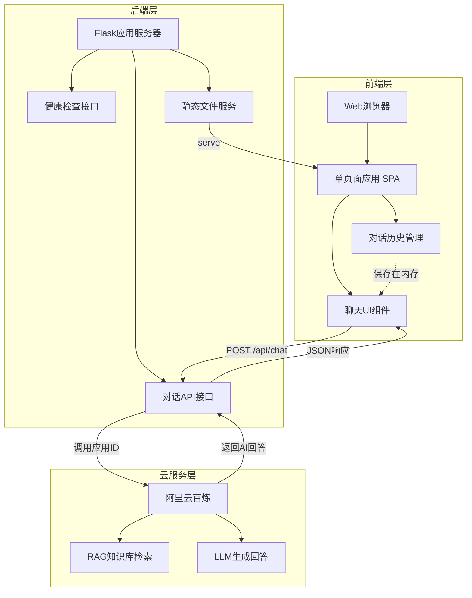
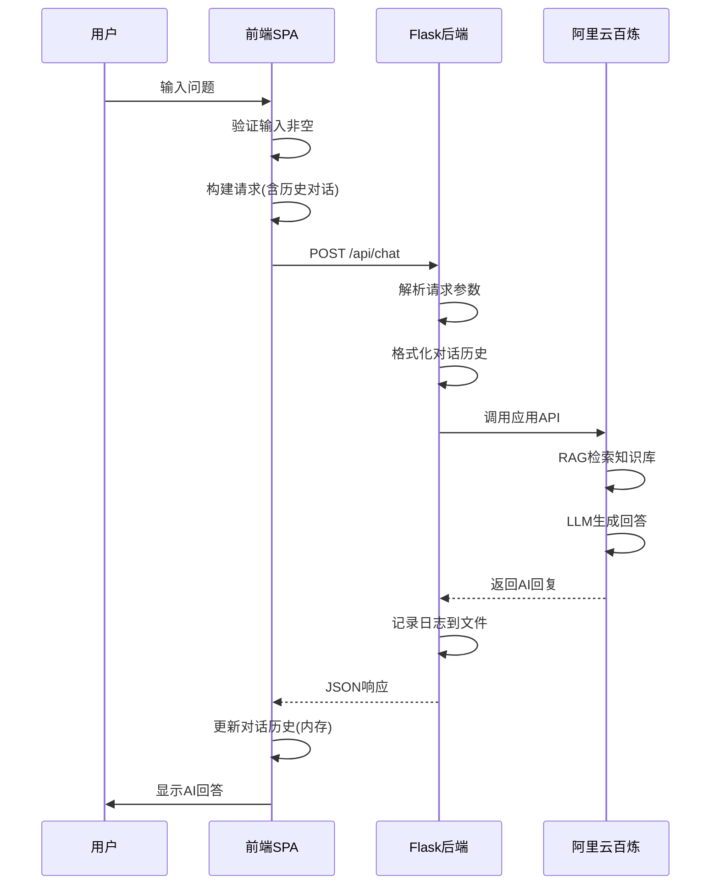

# PDSA数字分身智能体 - Web应用设计文档

## 1. 项目概述

### 1.1 设计目标

基于阿里云百炼RAG能力构建轻量级个人知识库问答系统,提供简洁的Web聊天界面,实现智能对话服务。

### 1.2 核心特性

- 单页面聊天应用,用户体验流畅
- 集成阿里云百炼应用ID,直接调用已配置RAG服务
- 前端内存维护对话历史,支持多轮对话
- 后端API密钥安全隔离,不暴露到前端
- 深色科技风格UI设计,视觉效果现代化
- 本地开发优先,预留云端迁移能力

### 1.3 技术方案选型

| 层级 | 技术选型 | 选型理由 |
|------|---------|---------|
| 前端框架 | 原生HTML/CSS/JavaScript | 零构建配置,快速开发,便于部署 |
| 后端框架 | Python Flask | 轻量级微框架,适合小型应用,易于上手 |
| AI服务 | 阿里云百炼 | 内置RAG检索,中文优化,开箱即用 |
| HTTP客户端 | Fetch API | 浏览器原生支持,无需额外依赖 |
| 环境配置 | python-dotenv | 安全管理API密钥和配置 |
| 百炼SDK | broadscope_bailian | 官方Python SDK,稳定可靠 |

## 2. 系统架构设计

### 2.1 整体架构



### 2.2 数据流设计



### 2.3 项目目录结构

```
pdsa-agent-one/
├── backend/                    # 后端服务目录
│   ├── app.py                 # Flask主应用程序
│   ├── requirements.txt       # Python依赖清单
│   ├── .env                   # 环境变量配置(不提交Git)
│   ├── .env.example          # 环境变量示例文件
│   └── chat_logs.txt         # 对话日志(运行时生成)
│
├── frontend/                   # 前端资源目录
│   ├── index.html            # 主页面HTML
│   ├── style.css             # 样式表
│   └── app.js                # 前端交互逻辑
│
├── docs/                      # 项目文档
│   └── README.md             # 使用说明文档
│
├── knowledge/                 # 知识库源文件
│   ├── about_me.md           # 个人介绍
│   ├── skills.md             # 技能清单
│   └── projects.md           # 项目经历
│
└── .gitignore                # Git忽略规则
```

## 3. 前端设计

### 3.1 页面结构设计

#### 整体布局

采用经典聊天应用三段式布局:

| 区域 | 功能 | 高度分配 |
|------|------|---------|
| Header区域 | 显示应用标题和说明 | 固定高度 80px |
| Messages区域 | 展示对话消息列表 | 自适应填充剩余空间 |
| Input区域 | 用户输入框和发送按钮 | 固定高度 80px |

#### HTML结构设计

```
body
└── .container (主容器)
    ├── header
    │   ├── h1 (标题: 🤖 个人数字分身)
    │   └── p (副标题: 基于你的知识库回答问题)
    │
    ├── .chat-container
    │   └── .messages (消息列表容器)
    │       ├── .message.bot (AI消息)
    │       │   └── .message-content
    │       └── .message.user (用户消息)
    │           └── .message-content
    │
    └── .input-container
        ├── input#userInput (输入框)
        └── button#sendBtn (发送按钮)
```

### 3.2 视觉设计规范

#### 色彩系统

**主色调 - 科技绿**
- 主绿色: `#00ff88` - 用于标题、按钮、高亮元素
- 深绿色: `#00cc6a` - 用于按钮悬停状态、阴影效果

**背景色系 - 深色主题**
- 主背景: `#1a1a1a` - 页面底色
- 次级背景: `#2d2d2d` - 卡片、消息气泡背景
- 半透明背景: `rgba(45, 45, 45, 0.8)` - 输入框、Header背景

**文字色彩**
- 主文字: `#ffffff` - 标题、正文
- 次级文字: `rgba(255, 255, 255, 0.9)` - 消息内容
- 辅助文字: `rgba(255, 255, 255, 0.7)` - 提示信息、占位符

**状态色彩**
- 错误提示: `#ff4444` - 错误消息背景
- 成功状态: `#00ff88` - 发送成功反馈

#### 视觉效果

**背景特效**
- 采用多层径向渐变营造深度感
- 渐变光晕位置: 左上、右下角
- 形成科技感氛围

**消息气泡设计**
- AI消息: 左对齐,背景色 `#2d2d2d`,圆角 `15px 15px 15px 5px`
- 用户消息: 右对齐,背景色 `#00ff88`,文字黑色,圆角 `15px 15px 5px 15px`
- 阴影效果: `0 2px 10px rgba(0, 255, 136, 0.1)`

**按钮设计**
- 主按钮: 绿色渐变背景,无边框,圆角 `8px`
- 悬停效果: 颜色加深至 `#00cc6a`,轻微放大
- 禁用状态: 透明度降低,光标变为 `not-allowed`

**动画效果**
- 消息进入: 从下方淡入,持续时间 `0.3s`
- 按钮交互: 过渡动画 `0.3s ease`
- 加载状态: "..." 动态显示

#### 字体规范

- 中文字体: Microsoft YaHei, 微软雅黑
- 英文字体: Arial, sans-serif
- 基础字号: `16px`
- 标题字号: `28px` (h1)

#### 间距规范

- 消息间距: `15px`
- 内边距: 消息气泡 `12px 18px`, 输入框 `12px 15px`
- 外边距: 容器边距 `20px`

### 3.3 交互设计

#### 用户输入交互

| 操作 | 触发条件 | 交互反馈 |
|------|---------|---------|
| 点击发送按钮 | 输入框非空 | 按钮变灰,显示"发送中..." |
| 按下回车键 | 输入框聚焦且非空 | 自动发送消息 |
| 输入为空时点击 | 输入框为空 | 无响应,按钮保持可点击 |
| 发送成功后 | 收到AI回复 | 清空输入框,自动滚动到底部 |

#### 消息展示交互

- 新消息添加时,自动滚动到消息列表底部
- AI回复时,先显示占位消息"AI思考中..."
- 消息以渐入动画出现,提升视觉体验

#### 错误处理反馈

| 错误类型 | 展示方式 | 持续时间 |
|---------|---------|---------|
| 网络请求失败 | 红色消息气泡显示错误信息 | 持久显示 |
| 后端返回错误 | 显示具体错误原因 | 持久显示 |
| 超时未响应 | 提示"请求超时,请重试" | 持久显示 |

### 3.4 前端数据管理

#### 对话历史存储结构

对话历史数组存储在JavaScript全局变量中:

```
chatHistory = [
    {
        user: "用户问题文本",
        bot: "AI回答文本"
    },
    {
        user: "第二个问题",
        bot: "第二个回答"
    }
]
```

#### 数据生命周期

- 初始化: 页面加载时为空数组
- 更新时机: 每次收到AI回复后追加新对话
- 清空条件: 页面刷新或关闭
- 传递方式: 每次请求将完整历史发送至后端

## 4. 后端设计

### 4.1 API接口设计

#### 接口1: 对话接口

**基本信息**

| 属性 | 值 |
|------|-----|
| 路径 | `/api/chat` |
| 方法 | POST |
| 内容类型 | application/json |
| 认证方式 | 无(API密钥在后端) |

**请求参数**

| 参数名 | 类型 | 必填 | 说明 | 示例 |
|--------|------|------|------|------|
| message | string | 是 | 用户当前问题 | "你是谁?" |
| history | array | 否 | 历史对话记录 | 见下方结构 |

history数组结构:
```
[
    {"user": "历史问题1", "bot": "历史回答1"},
    {"user": "历史问题2", "bot": "历史回答2"}
]
```

**响应格式**

成功响应:
```
{
    "success": true,
    "reply": "AI生成的回答内容"
}
```

失败响应:
```
{
    "success": false,
    "error": "错误描述信息"
}
```

**HTTP状态码**

| 状态码 | 说明 |
|--------|------|
| 200 | 成功返回AI回复 |
| 400 | 请求参数错误(如缺少message) |
| 500 | 服务器内部错误或百炼API调用失败 |

#### 接口2: 健康检查接口

**基本信息**

| 属性 | 值 |
|------|-----|
| 路径 | `/api/health` |
| 方法 | GET |
| 用途 | 检查服务是否正常运行 |

**响应格式**

```
{
    "status": "ok",
    "message": "Service is running"
}
```

#### 接口3: 静态文件服务

| 路径 | 说明 |
|------|------|
| `/` | 返回 `frontend/index.html` |
| `/style.css` | 返回 `frontend/style.css` |
| `/app.js` | 返回 `frontend/app.js` |

### 4.2 阿里云百炼集成设计

#### 调用方式

使用broadscope_bailian SDK的应用调用模式:

**必需参数**

| 参数 | 来源 | 说明 |
|------|------|------|
| app_id | 环境变量 BAILIAN_APP_ID | 百炼平台创建的应用ID |
| access_key_id | 环境变量 ALIBABA_CLOUD_ACCESS_KEY_ID | 阿里云AccessKey ID |
| access_key_secret | 环境变量 ALIBABA_CLOUD_ACCESS_KEY_SECRET | 阿里云AccessKey Secret |

**百炼应用ID获取步骤**

1. 访问阿里云百炼控制台: https://bailian.console.aliyun.com/
2. 进入「应用中心」页面
3. 找到已创建的应用,点击查看详情
4. 复制应用ID(格式通常为: app-xxxxx)
5. 粘贴到.env文件的BAILIAN_APP_ID配置项

**AccessKey获取步骤**

1. 访问阿里云AccessKey管理页面: https://ram.console.aliyun.com/manage/ak
2. 点击「创建AccessKey」按钮
3. 保存AccessKey ID和AccessKey Secret(仅显示一次)
4. 分别填入.env文件的对应配置项
5. 安全建议: 为百炼服务单独创建RAM子账号和授权

**调用流程**

1. 接收前端传来的message和history
2. 构建消息格式,将历史对话转换为百炼要求的格式
3. 调用应用API,传入当前问题
4. 流式接收响应(可选)或等待完整响应
5. 提取AI回复文本返回前端

#### 对话历史处理

百炼API需要的对话格式:

- 将前端的 `{user: "...", bot: "..."}` 转换为多条消息
- 每轮对话拆分为两条消息: 用户角色、助手角色
- 最后追加当前用户问题

转换逻辑示例:

```
输入: 
history = [{"user": "问题1", "bot": "回答1"}]
message = "问题2"

转换为百炼格式:
[
    {"role": "user", "content": "问题1"},
    {"role": "assistant", "content": "回答1"},
    {"role": "user", "content": "问题2"}
]
```

### 4.3 日志记录设计

#### 日志文件

- 文件路径: `backend/chat_logs.txt`
- 编码格式: UTF-8
- 写入模式: 追加模式(append)

#### 日志内容

每次对话记录以下信息:

| 字段 | 说明 |
|------|------|
| 时间戳 | 格式: YYYY-MM-DD HH:MM:SS |
| 用户问题 | 原始输入文本 |
| AI回复 | 完整回复内容 |
| 分隔符 | 使用 "---" 分隔不同对话 |

日志格式示例:

```
[2025-01-15 14:30:25]
用户: 你是谁?
AI: 我是您的个人数字分身...
---
```

### 4.4 环境配置设计

#### .env文件结构

```
# ============================================
# 阿里云访问凭证配置
# ============================================
# 获取方式: 登录阿里云控制台 -> AccessKey管理 -> 创建AccessKey
# 文档链接: https://help.aliyun.com/document_detail/116401.html
# 安全提示: 请勿将此文件提交到Git仓库
ALIBABA_CLOUD_ACCESS_KEY_ID=your_access_key_id_here
ALIBABA_CLOUD_ACCESS_KEY_SECRET=your_access_key_secret_here

# ============================================
# 阿里云百炼应用配置
# ============================================
# 获取方式: 百炼控制台 -> 应用中心 -> 选择应用 -> 应用ID
# 文档链接: https://help.aliyun.com/zh/bailian/
# 注意: 需要先在百炼平台创建应用并关联知识库
BAILIAN_APP_ID=your_bailian_app_id_here

# ============================================
# Flask应用配置
# ============================================
# 开发环境设置为development,生产环境设置为production
FLASK_ENV=development
# 服务监听端口,默认5000
FLASK_PORT=5000
```

#### 配置加载机制

- 使用 python-dotenv 库加载环境变量
- 应用启动时验证必需配置是否存在
- 缺少关键配置时抛出明确错误提示,指引用户配置

#### 配置验证规则

| 配置项 | 验证规则 | 错误提示 |
|--------|---------|----------|
| ALIBABA_CLOUD_ACCESS_KEY_ID | 不能为空或默认值 | "请在.env文件中配置阿里云AccessKey ID" |
| ALIBABA_CLOUD_ACCESS_KEY_SECRET | 不能为空或默认值 | "请在.env文件中配置阿里云AccessKey Secret" |
| BAILIAN_APP_ID | 不能为空或默认值 | "请在.env文件中配置百炼应用ID" |
| FLASK_PORT | 必须是1-65535的数字 | "端口号配置错误,请使用1-65535之间的数字" |

### 4.5 错误处理设计

#### 异常捕获策略

| 异常类型 | 处理方式 | 返回给前端 |
|---------|---------|-----------|
| 参数缺失 | 返回400错误 | "缺少必需参数: message" |
| 百炼API调用失败 | 捕获异常,记录日志 | "AI服务暂时不可用,请稍后重试" |
| 网络超时 | 设置超时时间30秒 | "请求超时,请重试" |
| 未知错误 | 记录完整堆栈 | "服务器错误,请联系管理员" |

#### 日志记录错误

- 错误信息同样写入 chat_logs.txt
- 标注为 "[ERROR]" 前缀
- 包含错误类型和堆栈信息

## 5. 依赖管理设计

### 5.1 Python依赖清单

requirements.txt内容:

| 包名 | 版本要求 | 用途 |
|------|---------|------|
| Flask | >=2.3.0 | Web框架 |
| flask-cors | >=4.0.0 | 跨域支持 |
| broadscope-bailian | latest | 阿里云百炼SDK |
| python-dotenv | >=1.0.0 | 环境变量管理 |

### 5.2 安装策略

- 使用国内镜像源加速下载
- 推荐清华大学PyPI镜像: `https://pypi.tuna.tsinghua.edu.cn/simple/`
- 安装命令: `pip install -r requirements.txt -i https://pypi.tuna.tsinghua.edu.cn/simple/`

### 5.3 前端依赖

无需npm或其他包管理器,使用浏览器原生API:

- Fetch API: HTTP请求
- DOM API: 页面操作
- ES6+: 现代JavaScript语法

## 6. 部署设计

### 6.1 本地开发环境

#### 环境要求

| 组件 | 版本要求 |
|------|---------|
| Python | >= 3.8 |
| pip | 最新版本 |
| 浏览器 | Chrome/Firefox/Edge 现代浏览器 |

#### 启动流程

1. 配置环境变量: 复制 .env.example 为 .env,填入真实密钥
2. 安装Python依赖: 执行 pip install 命令
3. 启动Flask服务: 运行 python backend/app.py
4. 访问应用: 浏览器打开 http://localhost:5000

#### 开发模式特性

- Flask调试模式开启,代码修改自动重载
- 详细错误堆栈信息输出
- CORS允许本地跨域请求

### 6.2 阿里云迁移预留设计

#### 迁移准备事项

| 准备项 | 说明 |
|--------|------|
| 百炼应用配置 | 确保知识库已上传,应用已创建 |
| ECS实例 | 推荐与百炼同区域(如华东2) |
| 安全组配置 | 开放5000端口(或自定义端口) |
| 环境变量配置 | 在服务器上配置.env文件 |

#### 部署方式选项

**方式1: 直接运行Python**
- 使用 nohup 或 screen 保持进程运行
- 适合快速测试,不推荐生产环境

**方式2: Gunicorn + Nginx**
- Gunicorn作为WSGI服务器
- Nginx作为反向代理和静态文件服务
- 推荐生产环境使用

**方式3: Docker容器化**
- 编写Dockerfile打包应用
- 使用docker-compose管理服务
- 便于迁移和扩展

#### 配置调整点

| 配置项 | 本地开发 | 云端生产 |
|--------|---------|---------|
| FLASK_ENV | development | production |
| DEBUG模式 | True | False |
| 监听地址 | 127.0.0.1 | 0.0.0.0 |
| 端口 | 5000 | 80/443(通过Nginx代理) |
| 日志级别 | DEBUG | INFO/WARNING |

### 6.3 安全加固设计

#### API密钥保护

- 绝不在前端代码中硬编码密钥
- .env文件加入 .gitignore,不提交版本控制
- 云端部署使用ECS实例RAM角色(可选)

#### 访问控制

- 生产环境关闭Flask调试模式
- 配置CORS白名单,限制允许的域名
- 可选增加请求频率限制防止滥用

#### HTTPS支持

- 云端部署配置SSL证书
- 使用Let's Encrypt免费证书
- Nginx配置HTTPS重定向

## 7. 知识库准备指南

### 7.1 知识库文件组织

建议知识库文件采用Markdown格式,结构化组织:

| 文件名 | 内容类型 | 示例内容 |
|--------|---------|---------|
| about_me.md | 个人介绍 | 姓名、职业、背景、特点 |
| skills.md | 技能清单 | 技术栈、工具、证书、专长 |
| projects.md | 项目经历 | 项目名称、职责、成果、技术 |
| experience.md | 工作经历 | 公司、职位、时间、业绩 |
| philosophy.md | 理念观点 | 工作理念、价值观、方法论 |

### 7.2 百炼平台配置步骤

#### 步骤1: 上传知识库文件

1. 登录阿里云百炼控制台
2. 进入"数据管理"页面
3. 创建知识库,上传所有Markdown文件
4. 等待文档解析完成

#### 步骤2: 创建应用

1. 进入"应用中心"
2. 点击"创建应用"
3. 选择"智能体应用"类型
4. 关联刚才创建的知识库
5. 配置应用参数:
   - 模型选择: 推荐qwen-plus或qwen-max
   - 检索设置: 开启RAG检索
   - 回复风格: 根据需求自定义
6. 保存应用,获取应用ID

#### 步骤3: 测试应用

- 在百炼控制台测试对话
- 验证知识库检索是否生效
- 调整提示词优化回复质量

### 7.3 知识库内容编写建议

#### 内容结构化

- 使用Markdown标题分层组织
- 重要信息使用列表或表格
- 避免大段无结构文本

#### 信息完整性

- 补充足够的上下文信息
- 避免使用代词,明确指代对象
- 关键术语提供解释

#### 更新维护

- 定期更新知识库内容
- 根据对话日志发现知识盲区
- 补充常见问题的答案

## 8. 开发实施建议

### 8.1 开发顺序

建议按以下顺序实施开发:

#### 第一阶段: 后端基础搭建

1. 创建项目目录结构
2. 编写Flask应用框架
3. 配置环境变量加载(重点预留配置入口)
4. 实现健康检查接口

**重点: 配置入口预留规范**

在app.py文件开头需包含以下配置加载和验证代码:

配置加载区域应包含:
- 清晰的注释说明每个配置项的用途
- 配置项来源说明(从哪个环境变量读取)
- 默认值设置(如果适用)
- 配置验证逻辑(检查必填项)
- 友好的错误提示(告诉用户如何修复)

注释规范示例:
```
# ========================================
# 配置加载区域
# ========================================
# 从.env文件加载环境变量
# 请确保.env文件存在且包含必需的配置项

# 加载.env文件
load_dotenv()

# 阿里云AccessKey配置
# 用途: 调用阿里云百炼API的身份认证
# 获取: 阿里云控制台 -> AccessKey管理
ACCESS_KEY_ID = os.getenv('ALIBABA_CLOUD_ACCESS_KEY_ID')
ACCESS_KEY_SECRET = os.getenv('ALIBABA_CLOUD_ACCESS_KEY_SECRET')

# 百炼应用ID配置
# 用途: 指定要调用的百炼应用
# 获取: 百炼控制台 -> 应用中心 -> 应用详情
APP_ID = os.getenv('BAILIAN_APP_ID')

# 配置验证
if not ACCESS_KEY_ID or ACCESS_KEY_ID == 'your_access_key_id_here':
    raise ValueError(
        "缺少配置: ALIBABA_CLOUD_ACCESS_KEY_ID\n"
        "请在.env文件中配置阿里云AccessKey ID\n"
        "获取方式: https://ram.console.aliyun.com/manage/ak"
    )
```

#### 第二阶段: 百炼集成

1. 安装百炼SDK
2. 实现对话API接口(重点添加配置注释)
3. 测试百炼应用调用
4. 添加日志记录功能

**重点: 百炼API调用代码注释规范**

在调用百炼API的函数中,需包含:

注释要点:
- API调用的目的和功能说明
- 使用的配置参数及其来源
- 参数格式要求和示例
- 可能的错误情况和处理方式
- 返回值结构说明

函数注释示例:
```
def call_bailian_api(user_message, chat_history):
    """
    调用阿里云百炼应用API获取智能回复
    
    参数说明:
        user_message (str): 用户当前输入的问题
        chat_history (list): 历史对话列表,格式: [{"user": "...", "bot": "..."}]
    
    返回值:
        str: AI生成的回复内容
    
    配置依赖:
        - ACCESS_KEY_ID: 阿里云AccessKey ID (从环境变量加载)
        - ACCESS_KEY_SECRET: 阿里云AccessKey Secret (从环境变量加载)
        - APP_ID: 百炼应用ID (从环境变量加载)
    
    异常处理:
        - 网络错误: 返回友好提示信息
        - 认证失败: 检查AccessKey配置
        - 应用不存在: 检查APP_ID配置
    
    示例:
        >>> call_bailian_api("你是谁?", [])
        "我是您的个人数字分身..."
    """
    # 1. 初始化百炼客户端
    # 使用环境变量中的AccessKey进行身份认证
    client = BailianClient(
        access_key_id=ACCESS_KEY_ID,      # 从.env文件加载
        access_key_secret=ACCESS_KEY_SECRET  # 从.env文件加载
    )
    
    # 2. 构建请求参数
    # app_id: 指定要调用的百炼应用
    # messages: 包含历史对话和当前问题的消息列表
    ...
```

#### 第三阶段: 前端开发

1. 编写HTML页面结构
2. 实现CSS样式(深色科技风)
3. 开发JavaScript交互逻辑
4. 对接后端API接口

#### 第四阶段: 联调测试

1. 本地启动完整服务
2. 测试完整对话流程
3. 验证对话历史功能
4. 优化交互体验

#### 第五阶段: 完善优化

1. 错误处理增强
2. 加载状态优化
3. 编写README文档
4. 准备云端迁移

### 8.2 测试验证点

#### 功能测试

| 测试项 | 验证内容 |
|--------|---------|
| 单轮对话 | 发送问题,收到合理回复 |
| 多轮对话 | 上下文记忆是否生效 |
| 知识库检索 | 回答是否基于知识库内容 |
| 错误处理 | 各类异常是否有友好提示 |
| 日志记录 | 对话是否正确写入日志文件 |

#### 界面测试

| 测试项 | 验证内容 |
|--------|---------|
| 样式显示 | 深色主题、绿色主色调 |
| 响应式布局 | 不同屏幕尺寸适配 |
| 交互反馈 | 按钮状态、加载动画 |
| 消息滚动 | 新消息自动滚动到底部 |

#### 性能测试

- 单次请求响应时间 < 3秒
- 多轮对话无明显延迟
- 长对话历史不影响性能

### 8.3 常见问题预案

#### 问题1: 百炼API调用失败

**可能原因**
- AccessKey配置错误
- 应用ID不存在
- 网络连接问题
- 账户欠费

**解决方案**
- 检查.env配置是否正确
- 在百炼控制台验证应用ID
- 测试网络连通性
- 查看阿里云账户余额

#### 问题2: 回答质量不佳

**可能原因**
- 知识库内容不足
- 问题表述不清晰
- RAG检索未命中
- 模型选择不当

**解决方案**
- 补充完善知识库内容
- 在百炼控制台优化提示词
- 调整检索参数
- 尝试更强大的模型(如qwen-max)

#### 问题3: 对话历史混乱

**可能原因**
- 前端历史存储逻辑错误
- 后端历史格式转换问题
- 百炼多轮对话配置问题

**解决方案**
- 检查前端chatHistory数组更新逻辑
- 验证发送给百炼的消息格式
- 查看百炼应用的对话设置

## 9. 扩展能力预留

### 9.1 功能扩展点

虽然当前版本为轻量级实现,但架构预留以下扩展能力:

| 扩展方向 | 实现思路 |
|---------|---------|
| 对话持久化 | 后端增加数据库存储历史会话 |
| 用户系统 | 增加登录注册,多用户隔离 |
| 对话分享 | 生成分享链接,展示对话内容 |
| 语音输入 | 集成Web Speech API |
| 流式输出 | 使用SSE实现打字机效果 |
| 工具调用 | 接入Function Calling能力 |
| 多知识库 | 支持切换不同知识库应用 |

### 9.2 性能优化方向

| 优化项 | 方案 |
|--------|------|
| 响应速度 | 启用百炼流式响应,边生成边显示 |
| 并发能力 | 使用Gunicorn多worker部署 |
| 缓存机制 | 对常见问题增加Redis缓存 |
| 前端优化 | 代码分割、懒加载、CDN加速 |

### 9.3 监控运维

| 监控项 | 工具/方法 |
|--------|----------|
| 服务可用性 | 配置健康检查接口的定时探测 |
| 错误日志 | 集成日志收集平台(如阿里云SLS) |
| 性能指标 | 记录请求耗时、成功率等 |
| 用户反馈 | 增加消息评价功能 |

## 10. 附录

### 10.1 关键技术文档链接

- 阿里云百炼官方文档: https://help.aliyun.com/zh/bailian/
- Flask官方文档: https://flask.palletsprojects.com/
- Python-dotenv文档: https://github.com/theskumar/python-dotenv

### 10.2 环境变量示例文件

.env.example文件内容(作为模板提供给用户):

```
# ============================================
# PDSA数字分身智能体 - 环境配置文件
# ============================================
# 使用说明:
# 1. 复制此文件并重命名为 .env
# 2. 按照下方注释说明填写真实的配置值
# 3. 确保.env文件已添加到.gitignore,避免泄露密钥
# ============================================

# ============================================
# 阿里云访问凭证配置 (必填)
# ============================================
# 获取步骤:
#   1. 登录阿里云控制台: https://ram.console.aliyun.com/manage/ak
#   2. 点击「创建AccessKey」
#   3. 保存显示的AccessKey ID和AccessKey Secret
#   4. 填入下方配置项,删除"your_"前缀
# 安全提示:
#   - 请勿在代码中硬编码密钥
#   - 建议为百炼服务创建专用的RAM子账号
#   - 定期轮换AccessKey
ALIBABA_CLOUD_ACCESS_KEY_ID=your_access_key_id_here
ALIBABA_CLOUD_ACCESS_KEY_SECRET=your_access_key_secret_here

# ============================================
# 阿里云百炼应用配置 (必填)
# ============================================
# 获取步骤:
#   1. 访问百炼控制台: https://bailian.console.aliyun.com/
#   2. 进入「应用中心」
#   3. 创建或选择已有应用
#   4. 确保应用已关联知识库
#   5. 复制应用ID(格式: app-xxxxx)
#   6. 填入下方配置项
# 注意事项:
#   - 应用ID格式通常为: app- 开头的字符串
#   - 确保应用状态为「已发布」
#   - 知识库文档需已上传并解析完成
BAILIAN_APP_ID=your_bailian_app_id_here

# ============================================
# Flask应用配置 (可选)
# ============================================
# FLASK_ENV: 运行环境
#   - development: 开发模式,启用调试和热加载
#   - production: 生产模式,关闭调试功能
FLASK_ENV=development

# FLASK_PORT: 服务监听端口
#   - 本地开发推荐: 5000
#   - 云端部署推荐: 80 或 8080
#   - 取值范围: 1-65535
FLASK_PORT=5000

# ============================================
# 配置完成检查清单
# ============================================
# [ ] 已填写阿里云AccessKey ID
# [ ] 已填写阿里云AccessKey Secret
# [ ] 已填写百炼应用ID
# [ ] 已在百炼控制台上传知识库文件
# [ ] 已验证百炼应用可正常对话
# [ ] 已确认.env文件在.gitignore中
# ============================================
```

### 10.3 Git忽略配置

.gitignore建议内容:

```
.env
__pycache__/
*.pyc
*.pyo
chat_logs.txt
.DS_Store
venv/
*.log
```
